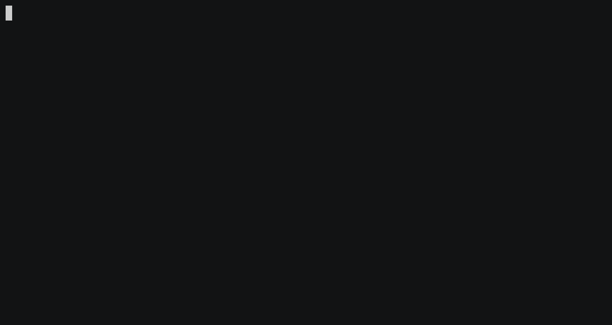

# snake

 [](https://codecov.io/gh/xvm32/snake)

This is a snake game I made to explore Rust a bit.

## Installation and playing



* It looks better in real life than on this asciicast, I promise.

```
cargo install --git https://github.com/xvm32/snake.git
```

Then run:

```
snake
```

## Development

You will need curses libraries:

```
sudo apt install libncurses5 libncurses5-dev
```

Fork the repository, and make a PR.

## Licensing

Licensed under the [MIT License](https://opensource.org/licenses/MIT). For details, see [LICENSE](https://github.com/xvm32/snake/blob/master/LICENSE).
